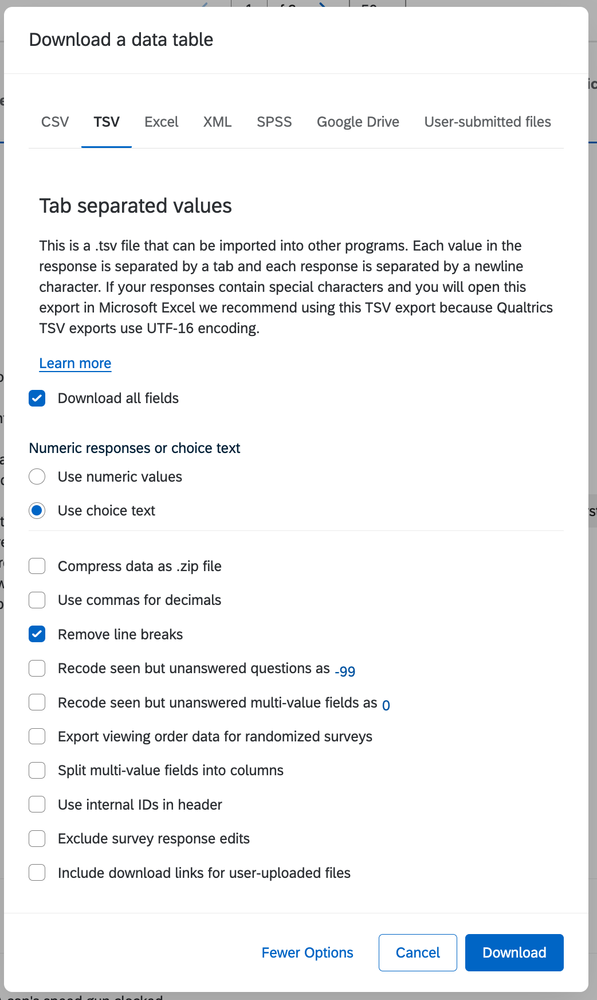

# Loss Project Analysis Code & Blog

This project is built in TypeScript and runs in deno.

If you do not have deno, you will need to [install deno](https://docs.deno.com/runtime/manual/getting_started/installation).

#### Configuration

To analyze the raw data, you will need access to the tab-separated value exports generated from Qualtrics. They are generated with line-breaks removed. (We are not committing into the public repository lest we risk accidentally exposing PII that might have snuck in there.)



 - Create an `analysis-input-raw` directory and copy the .TSV files there. Current data files required for analysis are:
    - `Pilot6.tsv`

#### Analyzing the raw data files
To run the analysis that produces all the data macros and graphs, use the following command.

```bash
deno task analyze
```

The files generated are tracked in git, so make sure to validate that any new results are free of PII before committing changes.

#### Preview the blog

The blog is automatically built via lume. You can preview the blog locally by running:

```bash
deno task serve
```

Or you can also build the blog into the _site directory (not stored in the git repository) via

```bash
deno task build
```

#### Directory structure

##### Data sources (must be populated manually)
 - `analysis-input-raw/` is where you need to the raw TSV (tab-separated value) survey files if you are analyzing them.

###### Data Analysis (TypeScript)

 - `src/analyze-survey-responses/` - Stage 1 analyzes survey responses stored in `analysis-input-raw/` and generates resulting data (mostly in `.ts` TypeScript format that are, themselves, code) which it places into `generated-by-analysis/` (which is managed by git, so the output gets committed to the repository as code).

 - `src/generate-blog-inputs/` - Stage 2, running just before the lume blogging system, consumes the data in `generated-by-analysis/` to generates graphs (and anything else non-textual) that should not be stored in git but that will be needed when producing the blog. The stage consumes data generated by the survey-response analysis which it reads from `generated-by-analysis/`, and populates the `graph` directory.

##### Generated data
 - `generated-by-analysis/` this directory contains TypeScript and other files that are automatically-generated by the survey response analysis for consumption by the blog's code and others (e.g) by `src/analyze-survey-responses/`

 - `graphs/` graphs images are placed here by the analysis run from `src/generate-blog-inputs`

##### Lume 2.0.2 blog files

`_config.ts` - Blog configuration code

`data/site.yaml` - Blog configuration data

`index.vto` - The site's home page in vento format

`posts/` - Contains blog posts

`404.md` - The blog's 404 not found page

`archive.page.js` - Javascript that products a summary of all posts hosted in the blog's `posts` directory

`archive.page.js` - Javascript that products a summary of all posts hosted in the blog's `posts` directory
